<h1><font color='#E50914'><center>Oldies but Goodies: A recommender system for Netflix's movie list expansion</center></font></h1>


```python
display(Image('outputs/banner.PNG'))
```


<h2><font color='#E50914'> Executive Summary </font></h2>

<p style="text-align:justify">The business value of recommender systems in digitally reliant industries is undeniable. User preference is the most important aspect of any product-oriented business so providing the best prediction for the next purchase is a big advantage.  Aside from this, recommender systems could also be used to increase the variety of products currently available.</p>

<p style="text-align:justify">In this technical paper, two separate datasets (Movielens & Netflix) containing user rating data for movies and shows, were utilized to expand the show line-up of Netflix. Movielens, a movie recommendation site has an extensive record of movie data with corresponding ratings from its community members. The goal is to identify some movies from this selection which could be added to the current Netflix show line up. After identifying common users from both datasets, the chosen Netflix users were added to the Movielens utility matrix to generate predicted ratings for all movies and in turn provide a list of recommendations. Two latent-based methods Singular Value Decomposition (SVD) and Non-negative Matrix Factorization (NMF) were used for recommendation generation. The SVD model produced 4,717 unique movies, meanwhile using NMF produced 9,471 movies to recommend to Netflix. Using error metrics such as RMSE, MSE, and MAE, these models were then evaluated where SVD was seen as the better performing model between the two.  The top recommendation item sets were then analyzed and chosen using frequent itemset mining methods by applying minimum support to generate a final list of shows recommended for inclusion in Netflix’s show line up.</p>

<p style="text-align:justify">We recommend future researchers to expand the scope of movie rating statistics and update rating data to the latest available one. We also suggest trying neighborhood based collaborative filtering (CF) methods and to introduce CF models in combination with content-based recommender systems.</p>


```python
# Import libraries

# Standard python library
import re
import os
import pickle
import seaborn as sns
from datetime import datetime
from IPython.display import display, Image
from tqdm import tqdm
import pandas as pd
from matplotlib import pyplot as plt
from matplotlib.ticker import MaxNLocator
from pandas.plotting import parallel_coordinates

from pyspark import SparkContext
# from surprise import (Reader, Dataset, SVD, NMF, accuracy)
# import fim

from IPython.display import HTML

tqdm.pandas()

NETFLIX_COLORS = ['#E50914', '#FCC252']

HTML('''<script>
code_show=true; 
function code_toggle() {
 if (code_show){
 $('div.input').hide();
 } else {
 $('div.input').show();
 }
 code_show = !code_show
} 
$( document ).ready(code_toggle);
</script>
<style>
.output_png {
    display: table-cell;
    text-align: center;
    horizontal-align: middle;
    vertical-align: middle;
    margin:auto;
}

tbody, thead {
    margin-left:100px;
}

</style>
<form action="javascript:code_toggle()"><input type="submit"
value="Click here to toggle on/off the raw code."></form>''')
```


<script>
code_show=true; 
function code_toggle() {
 if (code_show){
 $('div.input').hide();
 } else {
 $('div.input').show();
 }
 code_show = !code_show
} 
$( document ).ready(code_toggle);
</script>
<style>
.output_png {
    display: table-cell;
    text-align: center;
    horizontal-align: middle;
    vertical-align: middle;
    margin:auto;
}

tbody, thead {
    margin-left:100px;
}

</style>
<form action="javascript:code_toggle()"><input type="submit"
value="Click here to toggle on/off the raw code."></form>


<h2><font color='#E50914'> I. Introduction </font></h2>

<p style="text-align:justify">Netflix started out as a movie rental service, renting out DVDs of movies and sending them physically by mail. The business had grown from it inception in 1997, until their transition into a video streaming platform 10 years later. But the company is no stranger when it comes to recommender systems. As early as 2000, when they were still a movie-mailing business, they already introduced a personalized movie recommendation system based on the subscriber’s ratings on previous rentals. Fast forward to the present, as we know it, Netflix is one of the largest and most successful businesses thriving in the digital streaming era. They now have a proprietary recommendation system, to provide personalized suggestions to their users, which is much more complex to what they had before.  They consider several factors such as viewing history, time of day of watching, streaming duration, types of devices used and similarity to other user’s preferences.$^1$</p>

<p style="text-align:justify">Movielens, created at the same year as Netflix, is a research site with a recommender system powered by online users. Movie recommendations are made using collaborative filtering technology and the ratings that the other members enter. Unlike Netflix, it does not provide a streaming platform, but is mainly a recommendation platform for movies and shows. Movielens was created by the group GroupLens Research who specializes in recommender systems, online communities, digital libraries, and GIS. They have several datasets available online. Their datasets, most notably Movielens, have been big contributors in several research endeavors and are widely cited due to its open-source nature.</p>


<b> Problem Statement </b>

<p style="text-align:justify">Recommender systems tend to be exclusive. The insights generated are generally only for and from the users and movies already available in the platform.  In case the current platform wants to expand its choice of products, it cannot rely alone on internal data because these are already from existing items in the line-up. There is a need to incorporate an external data set and use it to generate recommendations for selection expansion. This time the recommender system will be used for the platform itself and not just for its users.</p>

<b>Motivation</b>

<p style="text-align:justify">This technical report focuses on the feasibility of using two different datasets in generating recommendations for product line up expansion. The insights gathered here can be utilized to effectively increase the selection of available shows for Netflix based on data from a long-standing movie evaluation platform such as Movielens. Although the data used in this study was from the time when Netflix was still a physical movie renting business, the method is projected to be as effective if implemented on its current virtual streaming platform.</p>

<h2><font color='#E50914'> II. Methodology </font></h2>


```python
display(Image('outputs/methodology.PNG'))
```


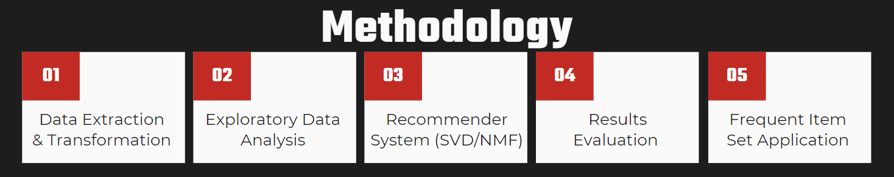


The methodology used in the study consists of 5 major steps as outlined below:

#### A. Extraction and transformation of data from Movielens and Netflix shared data.
<p style="text-align:justify">Creation of the main database focused on the extraction from two movie ratings sources, Netflix and Movielens. Several pre-processing and transformation steps were done depending on their extracted format in order to build separate datasets with standardized feature sets.

#### B. Perform exploratory data analysis to explore rating and movie trends.
<p style="text-align:justify">In performing exploratory data analysis, several trends involving the movie and rating distribution across the years were evaluated. Top rated shows were also found for each database and analyzed for common themes.

#### C. Implementation of latent-based recommender models such as SVD and NMF.
<p style="text-align:justify">Before application of the recommender models, a few filters were implemented on the users based on the common movies rated from both platforms. This will ensure that matches will occur when the similarity of users are evaluated. Recommender models were then trained and implemented for both Singular Value Decomposition (SVD) and Non-negative Matrix Factorization (NMF) and the corresponding 30 recommendations for each Netflix user was obtained.

#### D. Evaluation the results of the recommender systems using error metrics.
<p style="text-align:justify">The models were evaluated by looking at the user-item pairs that already has ratings in our database. Using <b>Surprise</b>, evaluation of such models involved building a test set, getting the prediction, and using the error metrics available. Error scores such as using Root Mean Squared Error (RMSE), Mean Squared Error, and Mean Absolute Error (MAE) were evaluated. 

#### E. Perform frequent itemset mining and look for association rules in the recommended movies.
<p style="text-align:justify">Frequent item set methods were then used to identify most common set of recommendations for Netflix users. Several combinations and associations were also evaluated in terms of their confidence and lift scores.

<h2><font color='#E50914'> III. Data Processing </font></h2>

### A. Extract and Preprocess Dataset

<b>Extract and Preprocess Netflix data</b>

<p style="text-align:justify">the Netflix datasets were extracted from Jojie which originated from the kaggle competition on <a href="https://www.kaggle.com/netflix-inc/netflix-prize-data">Netflix Prize data</a>. There are two datasets available in this project. The first one is a text file consisting of movie_id, its movie titles and the year the movie was produced. It consists of 17,770 unique movie titles as seen in table 1. </p>


```python
# extract movie titles
mv_title_path = '/mnt/localdata/public/netflixprize/download/'
mv_title = pd.read_csv(os.path.join(mv_title_path, 'movie_titles.txt'), 
                       sep=",", encoding = "ISO-8859-1", on_bad_lines='skip', 
                       names=['movie_id', 'year', 'movie_title'],
                       header=None)

# transform movie titles to be consistent with movie lens
mv_title['movie_title'] = mv_title.movie_title.str.lower()
mv_title.to_csv('netflix_movie_titles.csv', index=False)
```


```python
mv_title = pd.read_csv('netflix_movie_titles.csv')
display(HTML('''<p style="font-size:12px;font-style:default;">
<b>Table 1. Sample raw data from Netflix movie titles.</b></p>'''))
display(mv_title.head())
print(f'Total number of movies: {len(mv_title)}')
```


<p style="font-size:12px;font-style:default;">
<b>Table 1. Sample raw data from Netflix movie titles.</b></p>


<div>
<style scoped>
    .dataframe tbody tr th:only-of-type {
        vertical-align: middle;
    }

    .dataframe tbody tr th {
        vertical-align: top;
    }

    .dataframe thead th {
        text-align: right;
    }
</style>
<table border="1" class="dataframe">
  <thead>
    <tr style="text-align: right;">
      <th></th>
      <th>movie_id</th>
      <th>year</th>
      <th>movie_title</th>
    </tr>
  </thead>
  <tbody>
    <tr>
      <th>0</th>
      <td>1</td>
      <td>2003.0</td>
      <td>dinosaur planet</td>
    </tr>
    <tr>
      <th>1</th>
      <td>2</td>
      <td>2004.0</td>
      <td>isle of man tt 2004 review</td>
    </tr>
    <tr>
      <th>2</th>
      <td>3</td>
      <td>1997.0</td>
      <td>character</td>
    </tr>
    <tr>
      <th>3</th>
      <td>4</td>
      <td>1994.0</td>
      <td>paula abdul's get up &amp; dance</td>
    </tr>
    <tr>
      <th>4</th>
      <td>5</td>
      <td>2004.0</td>
      <td>the rise and fall of ecw</td>
    </tr>
  </tbody>
</table>
</div>


    Total number of movies: 17770
    

<p style="text-align:justify">The next datasets were text files for each movies that were rated by users. In total there are 10,533,585 total number of reviews from the users. To accomodate this large volume of data, the team used <code>pyspark</code> and <code>pandas</code> packages of Python for faster processing and transformation of data. Few initial preprocessing steps that was used for this dataset are the following: 
    <ul>
        <li>Split the string by comma</li>
        <li>Remove first line of the text files since it is just the movie_id where we already have information </li>
        <li>Get the movie_id in the file name</li>
        <li>Lowercase the movies to be case insensitive when merged with MovieLens</li>
        <li>Merge with movie titles dataset</li>
       </ul>
       </p>


```python
# create spark context to process big data
sc = SparkContext('local[*]')

# extract and transform data of netflix
path = '/mnt/localdata/public/netflixprize/download/training_set/'
fnames = os.listdir(path)

extracted = pd.DataFrame()
for fname in tqdm(fnames):
    netflix = (sc.textFile(path + fname)
                 .map(lambda x:x.split(','))
                 .filter(lambda x:len(x) > 1)
                 .map(lambda x: (*x, re.sub(r'mv_(.*?).txt', r'\1', fname)))
                 )
    extracted = extracted.append(pd.DataFrame(netflix.collect()))
    
# Merge movie title with the ratings data

# transform to make the data ready to be loaded in csv
extracted.columns = ['user_id', 'rating', 'date', 'movie_id']
extracted['movie_id'] = extracted.movie_id.astype(int)

nflix = pd.merge(extracted, mv_title, on='movie_id')
nflix['year'] = nflix.year.astype(int)

# re-arrange columns
nflix = nflix.loc[:, ['user_id', 'movie_id', 'date',
                      'year', 'movie_title', 'rating']]

nflix.to_csv('netflix_extracted.csv', index=False)

# Stop spark context
sc.stop()
```


```python
display(HTML('''<p style="font-size:12px;font-style:default;">
<b>Table 2. Sample raw data from Netflix rated movies.</b></p>'''))
nflix = pd.read_csv('netflix_extracted.csv')
display(nflix.head())
print(f'Total number of reviews: {len(nflix)}')
```


<p style="font-size:12px;font-style:default;">
<b>Table 2. Sample raw data from Netflix rated movies.</b></p>


<div>
<style scoped>
    .dataframe tbody tr th:only-of-type {
        vertical-align: middle;
    }

    .dataframe tbody tr th {
        vertical-align: top;
    }

    .dataframe thead th {
        text-align: right;
    }
</style>
<table border="1" class="dataframe">
  <thead>
    <tr style="text-align: right;">
      <th></th>
      <th>user_id</th>
      <th>movie_id</th>
      <th>date</th>
      <th>year</th>
      <th>movie_title</th>
      <th>rating</th>
    </tr>
  </thead>
  <tbody>
    <tr>
      <th>0</th>
      <td>1734805</td>
      <td>1250</td>
      <td>2001-02-04</td>
      <td>1996</td>
      <td>brassed off</td>
      <td>3</td>
    </tr>
    <tr>
      <th>1</th>
      <td>716091</td>
      <td>1250</td>
      <td>2000-01-08</td>
      <td>1996</td>
      <td>brassed off</td>
      <td>4</td>
    </tr>
    <tr>
      <th>2</th>
      <td>306466</td>
      <td>1250</td>
      <td>2001-04-05</td>
      <td>1996</td>
      <td>brassed off</td>
      <td>3</td>
    </tr>
    <tr>
      <th>3</th>
      <td>1945809</td>
      <td>1250</td>
      <td>2002-09-18</td>
      <td>1996</td>
      <td>brassed off</td>
      <td>1</td>
    </tr>
    <tr>
      <th>4</th>
      <td>1109700</td>
      <td>1250</td>
      <td>2001-10-26</td>
      <td>1996</td>
      <td>brassed off</td>
      <td>4</td>
    </tr>
  </tbody>
</table>
</div>


    Total number of reviews: 10533585
    

<b>Extract and Preprocess MovieLens data</b>

<p style="text-align:justify">Meanwhile, Movielens data came from two separate CSV format datasets. First was the movie dataset which included the show title and corresponding ID and genre list. The show title included the year the show was released at the end of the title string. Meanwhile the other dataset was the ratings dataset which included Movielens users and their individual ratings for several shows totaling to around 20 million reviews. It also includes a timestamp of the rating which was later on transformed to a datetime format (YYYY-MM-DD). The ratings range were from 1 to 5 with 0.5 increments and for the sake of uniformity was rounded up to implement a standard 1-5 rating same as Netflix.</p>


```python
# extract movie title data from movielens
ml1 = pd.read_csv('/mnt/data/public/movielens/20m/ml-20m/movies.csv')

# transform movie title and genre data

ml1['title'] = [i.lower() for i in ml1.title]
ml1['genres'] = [i.split('|') for i in ml1.genres]
for i in range(len(ml1)):
    if ml1['genres'][i] == ['(no genres listed)']:
        ml1['genres'][i] = []
        
#delete if not needed
ml1.drop(['genres'], axis=1, inplace=True) 
```


```python
# extract movie ratigs data from movielens
ml2 = pd.read_csv('/mnt/data/public/movielens/20m/ml-20m/ratings.csv')

# merge ratings and movie title data from movielens
mvlns = pd.merge(ml2, ml1, on='movieId')

# transform to make the data ready to be loaded in csv 
mvlns['movie_title'] = [i.partition(' (')[0] for i in mvlns.title]
mvlns['year'] = [re.findall(r'\(\d+\)', i) for i in mvlns.title]
mvlns['year'] = [''.join(i) for i in mvlns.year]
mvlns['year'] = [i[-5:-1] for i in mvlns.year]
mvlns['rating'] = round(mvlns['rating'])
mvlns['date'] = [datetime.fromtimestamp(i).date() for i in mvlns.timestamp]
mvlns.drop(['title', 'timestamp'], axis=1, inplace=True)

# format column names to match netflix
mvlns.rename(columns = {'userId':'user_id'}, inplace = True)
mvlns.rename(columns = {'movieId':'movie_id'}, inplace = True)

# re-arrange columns
mvlns = mvlns[['user_id', 'movie_id', 'date', 
               'year', 'movie_title', 'rating']]

mvlns.to_csv('movielens_extracted.csv', index=False)


```


```python
display(HTML('''<p style="font-size:12px;font-style:default;">
<b>Table 3. Sample raw data from MovieLens rated movies.</b></p>'''))
mvlns = pd.read_csv('movielens_extracted.csv')
display(mvlns.head())
print(f'Total number of reviews: {len(mvlns)}')
```


<p style="font-size:12px;font-style:default;">
<b>Table 3. Sample raw data from MovieLens rated movies.</b></p>


<div>
<style scoped>
    .dataframe tbody tr th:only-of-type {
        vertical-align: middle;
    }

    .dataframe tbody tr th {
        vertical-align: top;
    }

    .dataframe thead th {
        text-align: right;
    }
</style>
<table border="1" class="dataframe">
  <thead>
    <tr style="text-align: right;">
      <th></th>
      <th>user_id</th>
      <th>movie_id</th>
      <th>date</th>
      <th>year</th>
      <th>movie_title</th>
      <th>rating</th>
    </tr>
  </thead>
  <tbody>
    <tr>
      <th>0</th>
      <td>1</td>
      <td>2</td>
      <td>2005-04-03</td>
      <td>1995.0</td>
      <td>jumanji</td>
      <td>4.0</td>
    </tr>
    <tr>
      <th>1</th>
      <td>5</td>
      <td>2</td>
      <td>1996-12-25</td>
      <td>1995.0</td>
      <td>jumanji</td>
      <td>3.0</td>
    </tr>
    <tr>
      <th>2</th>
      <td>13</td>
      <td>2</td>
      <td>1996-11-27</td>
      <td>1995.0</td>
      <td>jumanji</td>
      <td>3.0</td>
    </tr>
    <tr>
      <th>3</th>
      <td>29</td>
      <td>2</td>
      <td>1996-06-24</td>
      <td>1995.0</td>
      <td>jumanji</td>
      <td>3.0</td>
    </tr>
    <tr>
      <th>4</th>
      <td>34</td>
      <td>2</td>
      <td>1996-10-28</td>
      <td>1995.0</td>
      <td>jumanji</td>
      <td>3.0</td>
    </tr>
  </tbody>
</table>
</div>


    Total number of reviews: 20000263
    

<b>Intersection of movies between Netflix and MovieLens</b>

<p style="text-align:justify">There are six types of customer persona that we could refer to this technical report:
    <ol type="a">
        <li>MovieLens users who watched MovieLens movies that are not available in Netflix</li>
        <li>MovieLens users who watched MovieLens movies with some of them available in Netflix</li>
        <li>MovieLens users who only watched movies available in Netflix</li>
        <li>Netflix users who watched Netflix movies that are not available in Movielens</li>
        <li>Netflix users who watched Netflix movies with some of them available in Movielens</li>
        <li>Netflix users who only watched movies available in Movielens</li>
    </ol>
<p style="text-align:justify">We are concerned on users (2) since we wanted to have a set of viewers with intersection with current available Netflix movies to be able to achieve similarity score with other Netflix users, and at the same time, will be able to recommend new movies from the the MovieLens database. Our targets are users (5) and (6), since they watched movies common already in the MovieLens database, and would seem more open to watch new movie recommendations from MovieLens.</p>       

<p style="text-align:justify">As an initial step the team filtered the common movies between Netflix and MovieLens to be used in exploratory data analysis and recommender system to be able to rate the movies in MovieLens that are not in Netflix.</p>

<b style="font-size:12px">Count of movies per platform before and after filtering common movies:</b>


```python
df_movielens_titles = pd.read_csv('movielens_titles.csv')
df_netflix_titles = pd.read_csv('netflix_movie_titles.csv')

# get intersect of movies between netflix and movielens
cnt = len(set(df_movielens_titles.movie_title) 
          & set(df_netflix_titles.movie_title))

common_movies = (set(df_movielens_titles.movie_title) 
                 & set(df_netflix_titles.movie_title))


print(f'Number of common movies between netflix and movielens: {cnt}')
```

    Number of common movies between netflix and movielens: 6142
    


```python
df_netflix = pd.read_csv('netflix_extracted.csv')
df_netflix_filtered = df_netflix[df_netflix.movie_title.isin(common_movies)]
print(f'Number of rated movies in netflix: {len(df_netflix)}')
print(f'Number of rated movies in netflix after filter: '
      f'{len(df_netflix_filtered)}')
```

    Number of rated movies in netflix: 10533585
    Number of rated movies in netflix after filter: 6781105
    


```python
df_movielens = pd.read_csv('movielens_extracted.csv', low_memory=False)
df_movielens_filtered = df_movielens[
    df_movielens.movie_title.isin(common_movies)]

print(f'Number of rated movies in movielens: {len(df_movielens)}')
print(f'Number of rated movies in movielens after filter: '
      f'{len(df_movielens_filtered)}')
```

    Number of rated movies in movielens: 20000263
    Number of rated movies in movielens after filter: 11940209
    


```python
df_netflix_filtered.to_csv('netflix_intersect.csv', index=False)
df_movielens_filtered.to_csv('movielens_intersect.csv', index=False)
```

### B. Data Description

The final data features which were chosen and made standard for both Netflix and Movielens data sets can be found in the table below:

<center style="font-size:12px;font-style:default;"><b>Table 4  Table Feature Names, Types and Descriptions</b></center>

| Feature Name | Data Type | Description |
| :- | :- | :- |
| user_id | int | Account user identifier |
| movie_id | int | Movie identifier code |
| date | datetime | Date the user made the rating |
| year | int64 | Year the movie was released |
| movie_title | str | Title of the Movie |
| rating | int64 | Ratings given by the user for the particular movie |

<h2><font color='#E50914'> IV. Exploratory Data Analysis </font></h2>


```python
# read data 
df_netflix = pd.read_csv('netflix_extracted.csv')
df_movielens = pd.read_csv('movielens_extracted.csv', low_memory=False)
netflix_intersect = pd.read_csv('netflix_intersect.csv')
movielens_intersect = pd.read_csv('movielens_intersect.csv', low_memory=False)
```

### A. Average ratings through the years

<p style="text-align:justify">The average ratings given per year were observed for both datasets. It is interesting to see the contrast of the average ratings by users over time. Movielens users tend to give erratic ratings, with no relation at all to time. No specific trend can be inferred from the average Movielens user ratings. Meanwhile for the Netflix users, there seems to be an upward trend of average ratings per year, increasing year on year.</p>

<p style="text-align:justify">These two different insights might be due to the nature of the datasets, Movielens strictly being a virtual community where only preferences are shared to any movie at any time. This as opposed to Netflix which was mail-based movie rental system during that time. The nature of the business can be influenced by the increase in the number of good selections year on year which could then also affect the ratings ever year.</p>

<p style="text-align:justify">The mean overall rating given by Movielens users in a span of 20 years was 3.52 meanwhile Netflix users have a mean rating of 3.62 in a span of 6 years.</p>


```python
df_movielens['date'] = [i[0:4] for i in df_movielens.date]
df_netflix['date'] = [i[0:4] for i in df_netflix.date]

display(HTML('''<center style="font-size:12px;font-style:default;"><b>
Figure 1. Average movie ratings per year for Netflix and Movielens.
</b></center>'''))

display(HTML(f'''<h3 style="text-align:center">
                <b style="color:{NETFLIX_COLORS[1]}">
                Average Yearly </b> ratings in MovieLens
                </h3>'''))

plt.figure(figsize=(10, 6))
df_movielens.groupby('date')['rating'].mean().plot(color='orange', lw=4)
plt.xlabel("Year", fontsize=12)
plt.ylabel("Average Ratings", fontsize=12)
ax = plt.gca()
ax.spines['top'].set_visible(False)
ax.spines['right'].set_visible(False)
ax.xaxis.set_major_locator(MaxNLocator(integer=True))
plt.show()

display(HTML(f'''<h3 style="text-align:center">
                <b style="color:{NETFLIX_COLORS[0]}">
                Average Yearly </b> ratings in Netflix
                </h3>'''))

plt.figure(figsize=(10, 6))
df_netflix.groupby('date')['rating'].mean().plot(color='red', lw=4)
plt.xlabel("Year", fontsize=12)
plt.ylabel("Average Ratings", fontsize=12)
ax = plt.gca()
ax.spines['top'].set_visible(False)
ax.spines['right'].set_visible(False)
ax.xaxis.set_major_locator(MaxNLocator(integer=True))
plt.show()
```


<center style="font-size:12px;font-style:default;"><b>
Figure 1. Average movie ratings per year for Netflix and Movielens.
</b></center>


<h3 style="text-align:center">
                <b style="color:#FCC252">
                Average Yearly </b> ratings in MovieLens
                </h3>


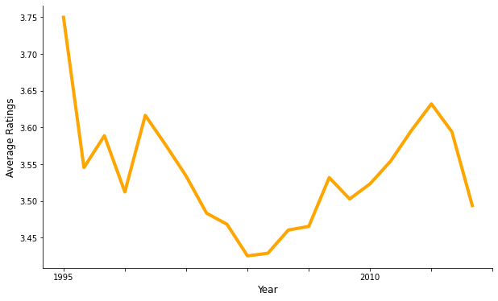


<h3 style="text-align:center">
                <b style="color:#E50914">
                Average Yearly </b> ratings in Netflix
                </h3>


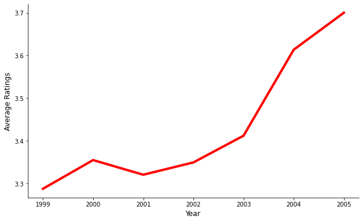


### B. Total count of ratings through the years

<p style="text-align:justify">The number of recorded ratings per year was also observed. The number of Movielens ratings have a general upward trend from 1995 to 2005, albeit fluctuating by some hundred thousand and reaching up to 2,000,000 at some point. Meanwhile ratings started to follow a more stable generally downward trend from 2005 onwards falling to less than 500,000 at 2015. The opposite is true for the number of yearly Netflix ratings as it consistently increases year on year, with an even steeper increase starting from 2003. There was a huge increase from 2003 with about a 1 million ratings to more than 5 million by 2005. This could mean two things: business is growing or a better feedback process was introduced.</p>


```python
display(HTML('''<center style="font-size:12px;font-style:default;"><b>
Figure 2. Total number of movie ratings per year for Netflix and Movielens.
</b></center>'''))

display(HTML(f'''<h3 style="text-align:center">
                <b style="color:{NETFLIX_COLORS[1]}">
                Total yearly number </b>of ratings in MovieLens
                </h3>'''))

plt.figure(figsize=(10, 6))
df_movielens.groupby('date')['rating'].count().plot(color='orange', lw=4)
plt.xlabel("Year", fontsize=12)
plt.ylabel("Total Number of Ratings", fontsize=12)
ax = plt.gca()
ax.spines['top'].set_visible(False)
ax.spines['right'].set_visible(False)
ax.xaxis.set_major_locator(MaxNLocator(integer=True))
plt.show()

display(HTML(f'''<h3 style="text-align:center">
                <b style="color:{NETFLIX_COLORS[0]}">
                Total yearly number </b>of ratings in Netflix
                </h3>'''))

plt.figure(figsize=(10, 6))
df_netflix.groupby('date')['rating'].count().plot(color='red', lw=4)
plt.xlabel("Year", fontsize=12)
plt.ylabel("Total Number of Ratings", fontsize=12)
ax = plt.gca()
ax.spines['top'].set_visible(False)
ax.spines['right'].set_visible(False)
ax.xaxis.set_major_locator(MaxNLocator(integer=True))
plt.show()
```


<center style="font-size:12px;font-style:default;"><b>
Figure 2. Total number of movie ratings per year for Netflix and Movielens.
</b></center>


<h3 style="text-align:center">
                <b style="color:#FCC252">
                Total yearly number </b>of ratings in MovieLens
                </h3>


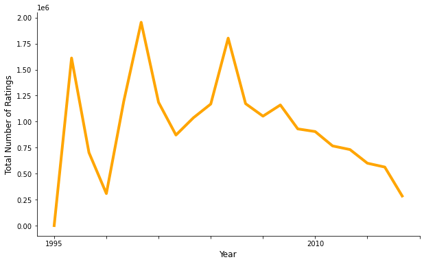


<h3 style="text-align:center">
                <b style="color:#E50914">
                Total yearly number </b>of ratings in Netflix
                </h3>


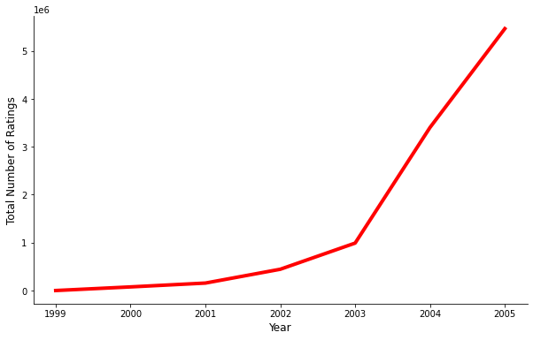


### C. Distribution of movies per year

<p style="text-align:justify">The number of available movies per release date, particularly the year, was also monitored. As expected, fewer movies are available for those released between 1920 to 1990. There is a notable increase in the number of movies from 1990 onwards for both datasets. It must be noted though that the number of movies available in Movielens are up to 6 times more than those available in Netflix. Movielens still is the bigger dataset in terms of movie choices.</p?


```python
display(HTML('''<center style="font-size:12px;font-style:default;"><b>
Figure 3. Total number of movies per year for Netflix and Movielens.
</b></center>'''))

movie_no = df_movielens.copy()
movie_no.drop(['user_id', 'movie_title', 'rating', 'date'],
              axis=1, inplace=True)
movie_no = movie_no.drop_duplicates(subset=['movie_id'], keep='first')
movie_no = movie_no[movie_no.year > 1890]
movie_no['year'] = [int(i) for i in movie_no.year]
movie_no = movie_no.loc[(movie_no['year'] >= 1914)]
movie_no = movie_no.loc[(movie_no['year'] < 2015)]

display(HTML(f'''<h3 style="text-align:center">
                <b style="color:{NETFLIX_COLORS[1]}">
                Total number</b> of movies in Movielens per year
                </h3>'''))

plt.figure(figsize=(10, 6));
movie_no.groupby('year')['movie_id'].count().plot(color='orange', lw=4);
plt.xlabel("Year", fontsize=12)
plt.ylabel("Number of Movies", fontsize=12)
ax = plt.gca()
ax.spines['top'].set_visible(False)
ax.spines['right'].set_visible(False)
ax.xaxis.set_major_locator(MaxNLocator(integer=True))
plt.show();

display(HTML(f'''<h3 style="text-align:center">
                <b style="color:{NETFLIX_COLORS[0]}">
                Total number</b> of movies in Netflix per year
                </h3>'''))

movie_no = df_netflix.copy()
movie_no.drop(['user_id', 'movie_title', 'rating', 'date'],
              axis=1, inplace=True)
movie_no = movie_no.drop_duplicates(subset=['movie_id'], keep='first')
movie_no = movie_no[movie_no.year != '']
movie_no['year'] = [int(i) for i in movie_no.year]
movie_no = movie_no.loc[(movie_no['year'] >= 1914)]
movie_no = movie_no.loc[(movie_no['year'] < 2005)]

plt.figure(figsize=(10, 6))
movie_no.groupby('year')['movie_id'].count().plot(color='red', lw=4);
plt.xlabel("Year", fontsize=12)
plt.ylabel("Number of Movies", fontsize=12)
ax = plt.gca()
ax.spines['top'].set_visible(False)
ax.spines['right'].set_visible(False)
ax.xaxis.set_major_locator(MaxNLocator(integer=True))
plt.show()
```


<center style="font-size:12px;font-style:default;"><b>
Figure 3. Total number of movies per year for Netflix and Movielens.
</b></center>


<h3 style="text-align:center">
                <b style="color:#FCC252">
                Total number</b> of movies in Movielens per year
                </h3>


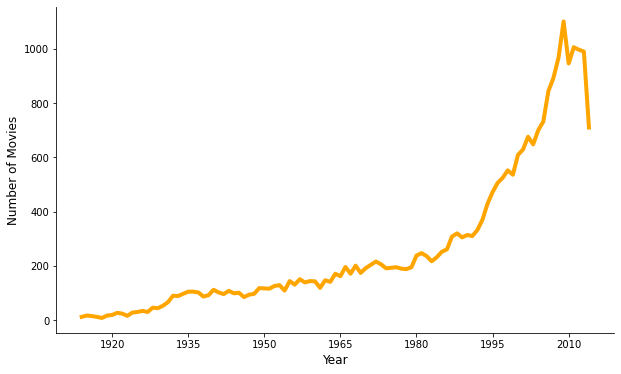


<h3 style="text-align:center">
                <b style="color:#E50914">
                Total number</b> of movies in Netflix per year
                </h3>


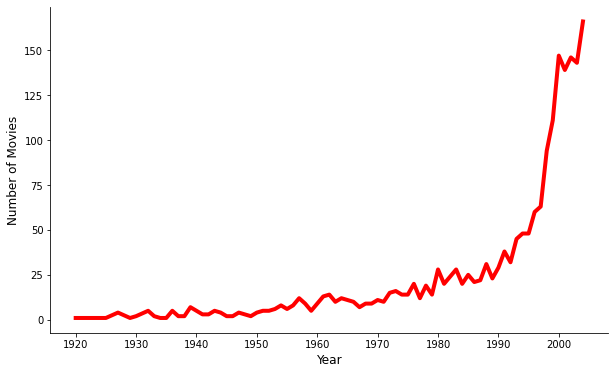


### D. Top rated movies

<p style="text-align:justify">The team defined top rated movies as the highest rated movies with at least 10,000 recorded ratings. There are some differences in terms of rated movies in both MovieLens and Netflix. MovieLens rated movies are classic movies like <i>Shawshank Redemption</i> and <i>The Godfather</i> while Netflix movies seems to have higher ratings on shows such as <i>The Simpsons</i> and <i>CSI</i>.</p>


```python
nflix_size = df_netflix.groupby('movie_title').size()
nflix_titles = nflix_size[nflix_size > 10000].index
mlens_size = df_movielens.groupby('movie_title')['rating'].size()
mlens_titles = mlens_size[mlens_size > 10000].index

(df_netflix[df_netflix.movie_title.isin(nflix_titles)]
                      .groupby('movie_title')['rating'].mean().nlargest(5))

(df_movielens[df_movielens.movie_title.isin(mlens_titles)]
 .groupby('movie_title')['rating'].mean().nlargest(5));
```

<center style="font-size:12px;font-style:default;"><b>
Figure 4. Top rated movies for Netflix and Movielens.
</b></center>


```python
display(Image('outputs/rated_1.png'))
display(Image('outputs/rated_2.png'))
```


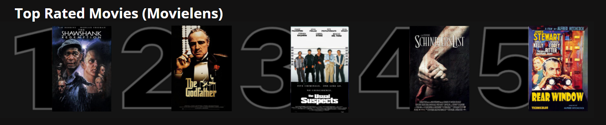


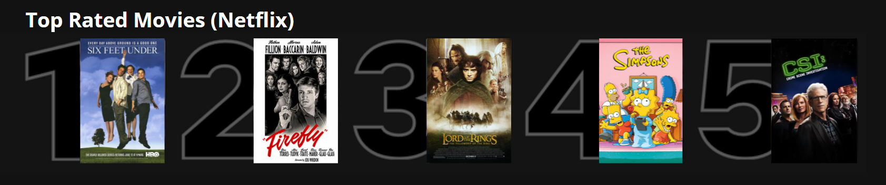


### E. Most rated movies

<p style="text-align:justify">Similar to the top rated movies, the most rated movies for MovieLens are classic movies such as <i>Pulp Fiction</i>, <i>Forrest Gump</i>. We can also observe that <i>Shawshank Redemption</i> was included in both top rated movies and most rated movies in MovieLens. Meanwhile, Netflix most rated movies are more mainstream movies like <i>Pirates of the Carribean</i> and <i>What Women Want</i>.


```python
display(HTML('''<center style="font-size:12px;font-style:default;"><b>
Figure 5. Most rated movies in Netflix and MovieLens.
</b></center>'''))

display(HTML(f'''<h3 style="text-align:center">
                <b style="color:{NETFLIX_COLORS[1]}">
                Most rated</b> movies in MovieLens
                </h3>'''))

plt.figure(figsize=(10, 6))
(df_movielens.groupby('movie_title')
           .size()
           .nlargest(5)
           .sort_values()
           .plot.barh(color=['lightgray','lightgray', NETFLIX_COLORS[1],
                         'lightgray', NETFLIX_COLORS[1]]))

plt.xlabel("Number of Ratings", fontsize=12)
plt.ylabel("Movie Titles", fontsize=12)
ax = plt.gca()
ax.spines['top'].set_visible(False)
ax.spines['right'].set_visible(False)
plt.show()


display(HTML(f'''<h3 style="text-align:center">
                <b style="color:{NETFLIX_COLORS[0]}">
                Most rated</b> movies in Netflix
                </h3>'''))

plt.figure(figsize=(10, 6))
(df_netflix.groupby('movie_title')
           .size()
           .nlargest(5)
           .sort_values()
           .plot.barh(color=['lightgray','lightgray', 'lightgray',
                         'lightgray', NETFLIX_COLORS[0]]))

plt.xlabel("Number of Ratings", fontsize=12)
plt.ylabel("Movie Titles", fontsize=12)
ax = plt.gca()
ax.spines['top'].set_visible(False)
ax.spines['right'].set_visible(False)
plt.show()
```


<center style="font-size:12px;font-style:default;"><b>
Figure 5. Most rated movies in Netflix and MovieLens.
</b></center>


<h3 style="text-align:center">
                <b style="color:#FCC252">
                Most rated</b> movies in MovieLens
                </h3>


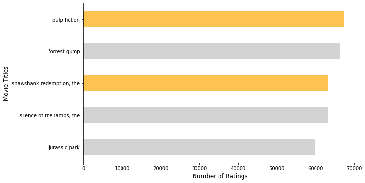


<h3 style="text-align:center">
                <b style="color:#E50914">
                Most rated</b> movies in Netflix
                </h3>


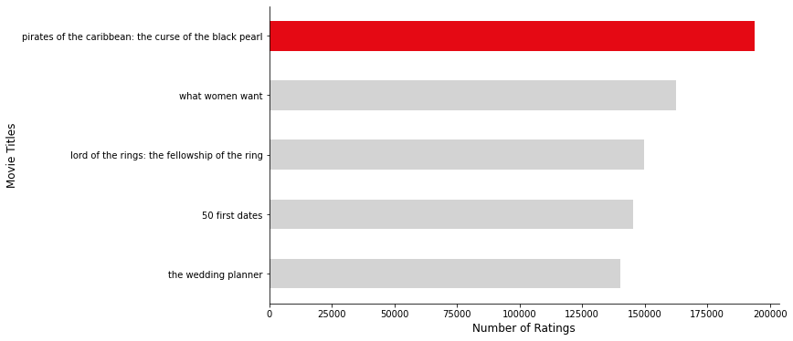


<h2><font color='#E50914'> V. Results and Discussion </font></h2>

### A. Collaborative Filtering

<p style="text-align:justify">The number of choices is always overwhelming that there is a need to filter only relevant information in order to alleviate the problem of information overload. Recommender systems solve this problem by searching through large volume of  information to provide users with personalized content. One of its application is music recommendation, and movie recommendation. There are many types of recommender system but in this project the team used  collaborative filtering since we do not have any information on the content and context of our data. In collaborative filtering, items are suggested based only on the similarity of ratings given by similar users.$^6$</p>

#### i. SVD Latent Factor Model Recommender System

<p style="text-align:justify">There are two classes of Collaborative Filtering (CF): Neighborhood based methods and Latent Factor models. Unlike Neighborhood based model where it is a user or item based approach to discover the user preference, Latent Factor models such as Singular Value Decomposition (SVD) extract features from the user-item matrix. SVD could generate factors that are latent to the data such as categories of the movies. One other advantage of using Latent Factor models is that it is not as resource intensive as neighborhood based models since we will just use latent factor matrices. In this project, since we are we dealing with more than ten million of data, the team decided to use Latent Factor model. The team used SVD since the data is sparse and one of its advantage over PCA is that there is no need to mean center the data.$^7$</p>

The process flow that the team developed for the SVD Latent Factor model recommender system is the following:
<ol>
<li><p style="text-align:justify"> Get intersection of Netflix and MovieLens since we are just interested in Netflix users who watched a movie in MovieLens in order to recommend new movies from MovieLens, otherwise there will be no intersection between platform and will not be possible to recommend.</p></li>
<li><p style="text-align:justify">Drop duplicates for each dataset if there are any to avoid any bias in a particular users.</p></li></ol>


```python
# Get intersection of netflix and movielens
# Drop duplicates for each dataset if there are any
netflix_intersect = netflix_intersect.drop_duplicates()
movielens_intersect = movielens_intersect.drop_duplicates()

# Remove user_id that rated less than 100 in the intersection
netflix_intersect = (netflix_intersect.groupby('user_id')
                                      .filter(lambda x: len(x) > 100))

netflix_users_count = netflix_intersect.groupby('user_id').size()

movielens_intersect = (movielens_intersect.groupby('user_id')
                                          .filter(lambda x: len(x) > 100))

movielens_users_count = movielens_intersect.groupby('user_id').size()

print(f'\tNumber of unique netflix users: {len(netflix_users_count)}')
print(f'\tNumber of unique movielens users: {len(movielens_users_count)}')
```

    	Number of unique netflix users: 3857
    	Number of unique movielens users: 32013
    

<ol start="3">
<li><p style="text-align:justify">Get only user_ids that rated at least one hundred movies in the intersection of the movie list. The recommendations could be erroneous if the users did not watched at least a minimum number of movies in the intersection of the movie list between platforms. For example, the intersection of two users between Netflix and MovieLens is just one movie and that they rated it both as 5, then it would give a high similarity score but the reality is that it could be an outlier.</p></li>
<li><p style="text-align:justify">Append "N" to users of netflix to avoid duplicate IDs with Movielens users</p></li>
<li><p style="text-align:justify">Drop movie_id of Netflix and get the movie_id of MovieLens based on the title of the movie to have a consistent movie_id label as we will append it to the MovieLens dataset.</p></li>
<li><p style="text-align:justify">Arrange the columns to (user, item, rating) for both Netflix and MovieLens which is expected to the <code>surprise.Dataset</code> package.</p></li>
<li><p style="text-align:justify">Append Netflix users to the whole MovieLens dataset</p></li>
<li><p style="text-align:justify">Perform SVD Latent Factor model based collaborative filtering using <code>Surprise</code> package of Python.</p></li>
<li><p style="text-align:justify">Get the top ten recommendations to Netlix users using movies from MovieLens that are not in the Netflix movie list</p></li>
</ol>


```python
# Append "N" to users of netflix to avoid duplicate id with movielens
netflix_intersect['user_id'] = 'N' + netflix_intersect.user_id.astype(str)

# Drop movie_id of Netflix
netflix_intersect = netflix_intersect.drop('movie_id', axis=1)


# Get the movie_id of MovieLens based on the title of the movie to have
# a consistent movie_id as we will append it to the MovieLens dataset.
netflix_intersect = pd.merge(netflix_intersect,
                             movielens_intersect.loc[:,
                                                     ['movie_title',
                                                      'movie_id']
                                                     ].drop_duplicates(),
                             on='movie_title')

# Arrange the columns to (user, item, rating) 
netflix_cf = netflix_intersect.loc[:, ['user_id', 
                                       'movie_id', 
                                       'rating']].copy()

valid_ids = movielens_intersect.user_id.to_numpy()
movielens_cf = df_movielens[df_movielens.user_id.isin(valid_ids)].copy()
# Arrange the columns to (user, item, rating) 
movielens_cf = movielens_cf.loc[:, ['user_id', 
                                    'movie_id', 
                                    'rating']]

# Append Netflix users to the whole MovieLens dataset
cf_dataset = pd.concat([movielens_cf, netflix_cf], axis=0)

# Fit SVD Latent Factor model based collaborative filtering 
svd = SVD(random_state=1337)
reader = Reader(rating_scale=(0,5))
data = Dataset.load_from_df(cf_dataset, reader)
svd.fit(data.build_full_trainset());

# Save the fitted model as pickle to be able to reuse it
with open('svd_cf.pkl', 'wb') as f:
    pickle.dump(svd, f, protocol=pickle.HIGHEST_PROTOCOL)
```


```python
def get_cf_predictions(model, new_movies, u, n):
    """ Get the top n movie recommendations for user u
    
    Parameters
    ==========
    model                :    surprise model
                              fitted model in training set
    new_movies           :    numpy.ndarray
                              list of new movies
    u                    :    str
                              user
    n                    :    int
                              number of returned movie recommendation
    
    Returns
    ==========
    get_cf_predictions   :     list
                               top n recommendations
    """
    testset = [[u, i, 0] for i in new_movies]
    predictions = model.test(testset)
    pred_ratings = np.array([pred.est for pred in predictions])
    top = pred_ratings.argsort()[::-1][:n]
    
    return set(new_movies[top])

common_movies = set(netflix_cf.movie_id)
ml_movies = set(movielens_cf.movie_id)
new_movies = np.array(list(ml_movies - common_movies))


nflix_users = pd.DataFrame(netflix_cf.user_id.drop_duplicates())
recos30 = nflix_users.user_id.progress_apply(lambda x: 
                                            get_cf_predictions(svd, 
                                            new_movies,
                                            x, 
                                            30))

nflix_users['recos'] = recos30
# save the data as pickle to preserve the set object in the column
nflix_users.to_pickle('nflixusers_recos30_svd.pkl')
```


```python
nflix_users = pd.read_pickle('nflixusers_recos30_svd.pkl')

display(HTML('''<p style="font-size:12px;font-style:default;">
<b>Table 5. Sample output of SVD recommender system.</b></p>'''))

display(nflix_users.head())
unique_col = sorted(set([item for row in nflix_users.recos for item in row]))
print(f'Number of unique movies: {len(unique_col)}')
```


<p style="font-size:12px;font-style:default;">
<b>Table 5. Sample output of SVD recommender system.</b></p>


<div>
<style scoped>
    .dataframe tbody tr th:only-of-type {
        vertical-align: middle;
    }

    .dataframe tbody tr th {
        vertical-align: top;
    }

    .dataframe thead th {
        text-align: right;
    }
</style>
<table border="1" class="dataframe">
  <thead>
    <tr style="text-align: right;">
      <th></th>
      <th>user_id</th>
      <th>recos</th>
    </tr>
  </thead>
  <tbody>
    <tr>
      <th>0</th>
      <td>N716091</td>
      <td>{3201, 3338, 912, 913, 26131, 923, 924, 162, 1189, 108583, 2731, 5291, 2351, 1212, 702, 1221, 69...</td>
    </tr>
    <tr>
      <th>1</th>
      <td>N306466</td>
      <td>{6016, 4226, 260, 527, 95654, 108583, 296, 1193, 2858, 1198, 47, 50, 1207, 98491, 318, 1221, 276...</td>
    </tr>
    <tr>
      <th>2</th>
      <td>N1945809</td>
      <td>{2947, 260, 1287, 904, 527, 912, 1276, 3095, 924, 1193, 1203, 1207, 1221, 6986, 7502, 32853, 858...</td>
    </tr>
    <tr>
      <th>3</th>
      <td>N1109700</td>
      <td>{1284, 904, 912, 913, 3224, 922, 923, 3739, 8228, 2726, 2351, 4271, 4405, 92475, 1212, 1340, 968...</td>
    </tr>
    <tr>
      <th>4</th>
      <td>N1331887</td>
      <td>{1284, 104069, 904, 905, 2186, 908, 910, 912, 913, 25748, 930, 108583, 1198, 942, 50, 96563, 950...</td>
    </tr>
  </tbody>
</table>
</div>


    Number of unique movies: 4717
    

<p style="text-align:justify">The output of the SVD latent factor model is in a table format with 2 columns: user_id are the user ids of the netflix users and recos are the top 30 MovieLens movie ids recommended to each user. There are <b>4,717</b> unique movies that we can recommend to Netflix</p>

#### ii. NMF Latent Factor Model Recommender System

<p style="text-align:justify">Another latent factor-based baseline algorithm for recommender systems is NMF or Non-negative Matrix Factorization. A non-negativity restriction is imposed to ensure that each user’s rating profile can be represented as an additive linear combination. It extracts significant features and commonalities from non-negative data for both items and users. The advantage of NMF is interpretability because it becomes easier to interpret the user and item values in terms of latent factors. For example, user and item factors can be interpreted as combination of preference to a specific genre. The team decided to use NMF because of the non-negative nature of the ratings.

<p style="text-align:justify">The same procedure or process flow was followed for the implementation of the NMF model except for a few additional pre-processing steps after Step 5. Shows with all zero ratings from all users were removed to prevent zero division during the NMF process. The final dataset based on (user, item, rating) format was then used in training the NMF collaborative filtering model using the <code>Surprise</code> package of Python. The top 30 show recommendations for each Netflix user were then obtained afterwards.


```python
# rating check
trial = pd.DataFrame({'rating_count' : 
                      cf_dataset.groupby('movie_id')['rating']
                      .sum()}).reset_index()

# delete movies with all zero ratings
delete_list = list(trial['movie_id'])
cf_dataset = cf_dataset[~cf_dataset['movie_id'].isin(delete_list)]


# train NMF model, n_factors & n_epoch are default values
nmf = NMF(n_factors=20, n_epochs=20, random_state=1337)
reader = Reader(rating_scale=(0,5))
data = Dataset.load_from_df(cf_dataset, reader)
nmf.fit(data.build_full_trainset());

# save the fitted model as pickle to be able to reuse it
with open('nmf_cf.pkl', 'wb') as f:
    pickle.dump(nmf, f, protocol=pickle.HIGHEST_PROTOCOL)
    
nflix_users = pd.DataFrame(netflix_cf.user_id.drop_duplicates())
nmf_recos = nflix_users.user_id.progress_apply(lambda x: 
                                               get_cf_predictions(nmf, 
                                                                  new_movies,
                                                                  x,
                                                                  30))

# save the data as pickle to preserve the set object in the column
nflix_users.to_pickle('nflixusers_recos_nmf.pkl')
nflix_users['recos'] = nmf_recos
```


```python
nflix_users = pd.read_pickle('nflixusers_recos_nmf.pkl')

display(HTML('''<p style="font-size:12px;font-style:default;">
<b>Table 6. Sample output of NMF recommender system.</b></p>'''))

display(nflix_users.head())
unique_col = sorted(set([item for row in nflix_users.recos for item in row]))
print(f'Number of unique movies: {len(unique_col)}')
```


<p style="font-size:12px;font-style:default;">
<b>Table 6. Sample output of NMF recommender system.</b></p>


<div>
<style scoped>
    .dataframe tbody tr th:only-of-type {
        vertical-align: middle;
    }

    .dataframe tbody tr th {
        vertical-align: top;
    }

    .dataframe thead th {
        text-align: right;
    }
</style>
<table border="1" class="dataframe">
  <thead>
    <tr style="text-align: right;">
      <th></th>
      <th>user_id</th>
      <th>recos</th>
    </tr>
  </thead>
  <tbody>
    <tr>
      <th>0</th>
      <td>N716091</td>
      <td>{92161, 72327, 96520, 78986, 27914, 80269, 92176, 109715, 97300, 26644, 64408, 109598, 60198, 10...</td>
    </tr>
    <tr>
      <th>1</th>
      <td>N306466</td>
      <td>{129536, 124550, 117907, 73365, 77736, 107434, 101292, 95021, 115119, 81072, 122290, 107964, 121...</td>
    </tr>
    <tr>
      <th>2</th>
      <td>N1945809</td>
      <td>{129536, 106115, 87948, 7568, 114193, 73365, 106517, 107673, 113947, 107434, 30764, 95021, 12881...</td>
    </tr>
    <tr>
      <th>3</th>
      <td>N1109700</td>
      <td>{26246, 74504, 74506, 26251, 74510, 92196, 55207, 73529, 120761, 73533, 112710, 120775, 8010, 80...</td>
    </tr>
    <tr>
      <th>4</th>
      <td>N1331887</td>
      <td>{116106, 116491, 116108, 87693, 83603, 85012, 25749, 117531, 87719, 69931, 91193, 116155, 116801...</td>
    </tr>
  </tbody>
</table>
</div>


    Number of unique movies: 9471
    

<p style="text-align:justify">Similar to the previous section, the output of the NMF latent factor model is in a table format with 2 columns: user_id are the user ids of the netflix users and recos are the top 30 MovieLens movie ids recommended to each user. There are <b>9,471</b> unique movies that we can recommend to Netflix</p>

### B. Evaluate the performance of the recommender system models

<p style="text-align:justify">Latent factor models are developed by decomposing the utility matrix into two and would attempt to learn the utility matrix supplied with the ratings to the unrated movies from the original utility matrix by means of coordinate descent. The trained models can be erroneous and evaluation for such models are important. One way to evaluate these models is by looking at the user-item pair that already has a rating in our database. The team used the dataset from the MovieLens users and got the error scores using <b>Root Mean Squared Error</b> (RMSE), <b>Mean Squared Error</b>, and <b>Mean Absolute Error</b> (MAE). Using <code>Surprise</code>, evaluation of such models can be easy. We first build a test set, get the prediction, and use the error metric built in to the package.</p>


```python
def eval_cf_predictions(model, x):
    """ Get the top n movie recommendations for user u
    
    Parameters
    ==========
    model                 :    surprise model
                               fitted model in training set
    x                     :    pandas.DataFrame
                               consists of columns user_id, movie_id, rating
    
    Returns
    ==========
    eval_cf_predictions   :     list
                                list of error metric
    """
    testset = [[x['user_id'], 
                x['movie_id'], 
                x['rating']] for i in new_movies]
    
    predictions = model.test(testset)
    
    return [accuracy.rmse(predictions, verbose=False),
            accuracy.mse(predictions, verbose=False), 
            accuracy.mae(predictions,verbose=False)] 
```


```python
# read pickle file
with open('svd_cf.pkl', 'rb') as f:
    svd = pickle.load(f)

# sample 100 instance of rating from 100 different users
metrics_svd = (movielens_cf.groupby('user_id')
                       .first()
                       .reset_index()[:100]
                       .progress_apply(lambda x: eval_cf_predictions(svd, x), 
                                       axis=1))
```


```python
# read pickle file
with open('nmf_cf.pkl', 'rb') as f:
    nmf = pickle.load(f)
    
    
# sample 100 instance of rating from 100 different users
metrics_nmf = (movielens_cf.groupby('user_id')
                       .first()
                       .reset_index()[:100]
                       .progress_apply(lambda x: eval_cf_predictions(nmf, x), 
                                       axis=1))
```


```python
svd_errors = pd.DataFrame(metrics_svd.to_list(), 
                          columns=['rmse', 'mse', 'mae'])

nmf_errors = pd.DataFrame(metrics_nmf.to_list(), 
                          columns=['rmse', 'mse', 'mae'])

display(HTML('''<center style="font-size:12px;font-style:default;"><b>
Figure 6. Error metrics of the models
</b></center>'''))

errors = {'SVD' : svd_errors, 'NMF' : nmf_errors}

for idx, model in enumerate(['SVD', 'NMF']):
    fig, ax = plt.subplots(1, 3, figsize=(15,4))
    plt.suptitle(model)
    ax[0].set_title('RMSE')
    errors[model]['rmse'].plot.hist(ax=ax[0], color=NETFLIX_COLORS[idx], 
                                   alpha=0.4)
    
    ax[1].set_title('MSE')
    errors[model]['mse'].plot.hist(ax=ax[1], color=NETFLIX_COLORS[idx], 
                                   alpha=0.4)
    
    ax[2].set_title('MAE')
    errors[model]['mae'].plot.hist(ax=ax[2], color=NETFLIX_COLORS[idx], 
                                   alpha=0.4);
```


<center style="font-size:12px;font-style:default;"><b>
Figure 6. Error metrics of the models
</b></center>


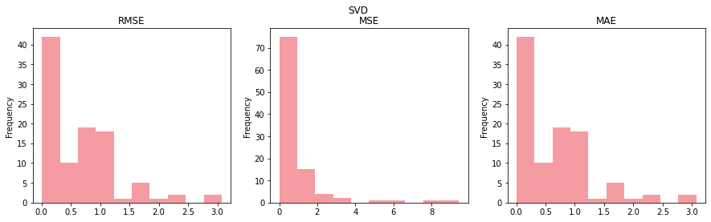


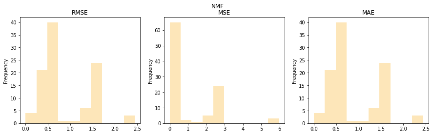


<p style="text-align:justify">The plotted histogram of the chosen error metrics shows that NMF model produces a larger error. RMSE shows a larger frequency in the area of 0 to 0.5 using SVD while 0.5 to 1.5 using NMF, although for larger error they are identical. Using MSE, the results are somehow identical to each other. While using MAE, it is similar to the results of RMSE.</p>


```python
svd_mean_err = pd.DataFrame(svd_errors.mean(axis=0), columns=['SVD']).T
nmf_mean_err = pd.DataFrame(nmf_errors.mean(axis=0), columns=['NMF']).T

display(HTML('''<p style="font-size:12px;font-style:default;">
<b>Table 7. Mean error metrics per model.</b></p>'''))
display(pd.concat([svd_mean_err, nmf_mean_err]))
```


<p style="font-size:12px;font-style:default;">
<b>Table 7. Mean error metrics per model.</b></p>


<div>
<style scoped>
    .dataframe tbody tr th:only-of-type {
        vertical-align: middle;
    }

    .dataframe tbody tr th {
        vertical-align: top;
    }

    .dataframe thead th {
        text-align: right;
    }
</style>
<table border="1" class="dataframe">
  <thead>
    <tr style="text-align: right;">
      <th></th>
      <th>rmse</th>
      <th>mse</th>
      <th>mae</th>
    </tr>
  </thead>
  <tbody>
    <tr>
      <th>SVD</th>
      <td>0.659525</td>
      <td>0.831446</td>
      <td>0.659525</td>
    </tr>
    <tr>
      <th>NMF</th>
      <td>0.872670</td>
      <td>1.066981</td>
      <td>0.872670</td>
    </tr>
  </tbody>
</table>
</div>


<p style="text-align:justify">The means of the chosen metrics over all the samples show that the SVD model performs better than NMF. Looking closely on the value of MAE, we can see that the results for NMF is quite large, we can interpret it as 0.87 error in the ratings of the user which could be significant when recommending a movie.</p>

### C. Frequent Itemset Mining and Associate Pattern Mining

<p style="text-align:justify">By now, The team have created top 30 list of recommendations for each user in Netflix that have watched at least a hundred movies common in both platforms. The team have also evaluated our two latent factor models and chose SVD as the better recommender system based on different metrics. The team also found out that using SVD we got a total of almost five thousand new movies to recommend to Netflix to add to their movie list. But supposed that Netflix does not have unlimited resources and cannot get all of the five thousand movies. The question now is how can they pick the most important movies that are more likely to be watched by users in NetFlix? With the number of new movies coming to the Netflix platform, how can they arrange the movie placement in order to suggest movies that are usually watched together? These questions can be answered by using Frequent Itemset Mining and Association Pattern Mining.</p>
<p style="text-align:justify">Frequent Itemset Mining looked at the itemsets that passes through a support, while Association Pattern Mining looked at the behavior of the itemsets and its likelihood to be watched together (lift greater than 1) or watched as a replacement movie. (lift less than 1). <code>fim</code> python package is used to implement these methods.</p>

<p style="text-align:justify">There are few important terms to remember in these methods:
    <ul>
        <li><code>Transaction</code>: User and its recommended new movies</li>
        <li><code>Items</code>: movies in the database</li>
    </ul>
</p>

<p style="text-align:justify">There are number of algorithms to be used depending on the number of users and items. Although the results are the same for each algorithm, it could differ on the speed of implementation. First let us check these parameters:</p>


```python
nflix_users = pd.read_pickle('nflixusers_recos30_svd.pkl')
unique_col = sorted(set([item for row in nflix_users.recos for item in row]))
print(f'Number of unique users: {len(nflix_users)}')
print(f'Number of unique items: {len(unique_col)}')
```

    Number of unique users: 3857
    Number of unique items: 4717
    

<p style="text-align:justify">Since there are more unique items than its users, we can use fpgrowth as it would yield to a faster result than other algorithms. The following sections used fpgrowth algorithm for its recommendation.</p>

#### i. Recommendations of movies based on support

<p style="text-align:justify">Frequent Itemset Mining can be used to get the most frequent movies that were watched by different users based on the minimum support. Some of the parameters that the team used:
    <ul>
        <li><code>supp:10</code> - Get the movies that were watched of at least ten percent of the users</li>
        <li><code>zmax:1</code> - 1-itemset to get the number of unique movies.</li>
    </ul>
    
</p>


```python
db = nflix_users.recos.to_list()
out = fim.fpgrowth(db, supp=10, zmax=1)
df_fim = pd.DataFrame(out)
df_fim.columns = ['movie_id', 'support']
```


```python
titles = pd.read_csv('movielens_titles.csv')

def get_movie_title(mov_ids):
    out = []
    if isinstance(mov_ids, int):
        mov = titles.loc[titles.movieId == mov_ids]
        return mov['movie_title'].to_list()[0]
    for x in mov_ids:
        mov = titles.loc[titles.movieId == x]
        out.append(mov['movie_title'].to_list()[0])
    return tuple(out)

display(HTML('''<p style="font-size:12px;font-style:default;">
<b>Table 8. Sample result of FIM.</b></p>'''))
df_fim['movie_titles'] = df_fim.movie_id.apply(lambda x: get_movie_title(x))
df_fim = df_fim.sort_values(by='support', ascending=False)
display(df_fim.iloc[:, [0, 2, 1]].head())
unique_mov = sorted(set([item for row in df_fim.movie_id for item in row]))
print(f'Number of unique recommendations to Netflix: {len(unique_mov)}')
```


<p style="font-size:12px;font-style:default;">
<b>Table 8. Sample result of FIM.</b></p>


<div>
<style scoped>
    .dataframe tbody tr th:only-of-type {
        vertical-align: middle;
    }

    .dataframe tbody tr th {
        vertical-align: top;
    }

    .dataframe thead th {
        text-align: right;
    }
</style>
<table border="1" class="dataframe">
  <thead>
    <tr style="text-align: right;">
      <th></th>
      <th>movie_id</th>
      <th>movie_titles</th>
      <th>support</th>
    </tr>
  </thead>
  <tbody>
    <tr>
      <th>0</th>
      <td>(318,)</td>
      <td>(shawshank redemption, the,)</td>
      <td>2107</td>
    </tr>
    <tr>
      <th>1</th>
      <td>(527,)</td>
      <td>(schindler's list,)</td>
      <td>1716</td>
    </tr>
    <tr>
      <th>2</th>
      <td>(86237,)</td>
      <td>(connections,)</td>
      <td>1653</td>
    </tr>
    <tr>
      <th>3</th>
      <td>(7502,)</td>
      <td>(band of brothers,)</td>
      <td>1320</td>
    </tr>
    <tr>
      <th>4</th>
      <td>(1198,)</td>
      <td>(raiders of the lost ark,)</td>
      <td>1241</td>
    </tr>
  </tbody>
</table>
</div>


    Number of unique recommendations to Netflix: 58
    

<center style="font-size:12px;font-style:default;"><b>
Figure 7. Top five recommended movies based on the number of supports
</b></center>


```python
display(Image('outputs/recommendations.png'))
```


<p style="text-align:justify">Using the given parameters, the team was able to fetch fifty eight unique movies to be recommended to Netflix which the team believed to be a good number of recommendations for the study. The results can be varied by changing the parameter <code>supp</code>. Increasing it would have a lesser number of recommendations while decreasing it would increase the number of recommendations.</p>

#### ii. Recommendations of movie placement based on lift

<p style="text-align:justify">Association Pattern Mining, can be used to place the movies that are likely to be watched together. To reiterate the higher the lift the better for them to be placed together. 
    <ul>
        <li><code>supp:10</code> - Get the movies that were watched of at least ten percent of the users (same with above)</li>
        <li><code>conf:60</code> - Minimum confidence of 60%</li>
        <li><code>report:l</code> - Report the lift of the association rules</li>
        <li><code>eval:l</code> - Evaluate the lift of the association rules</li>
        <li><code>target:r</code> - Set the type to association rules</li>
    </ul>
 </p>


```python
out = fim.fpgrowth(db, supp=10, conf=60, report='l', eval='l', target='r')
out = sorted(out, key=lambda x: (-x[2], x[0], len(x[1])))
df_lift = pd.DataFrame(out)
df_lift.columns = ['consequent', 'antecedent', 'lift']
df_lift['consequent_title'] = df_lift.consequent.apply(lambda x: 
                                                      get_movie_title(x))

df_lift['antecedent_title'] = df_lift.antecedent.apply(lambda x: 
                                                      get_movie_title(x))

display(HTML('''<p style="font-size:12px;font-style:default;">
<b>Table 9. Sample result of APM.</b></p>'''))
display(df_lift.iloc[:, [0, 1, 3, 4, 2]].head())
```


<p style="font-size:12px;font-style:default;">
<b>Table 9. Sample result of APM.</b></p>


<div>
<style scoped>
    .dataframe tbody tr th:only-of-type {
        vertical-align: middle;
    }

    .dataframe tbody tr th {
        vertical-align: top;
    }

    .dataframe thead th {
        text-align: right;
    }
</style>
<table border="1" class="dataframe">
  <thead>
    <tr style="text-align: right;">
      <th></th>
      <th>consequent</th>
      <th>antecedent</th>
      <th>consequent_title</th>
      <th>antecedent_title</th>
      <th>lift</th>
    </tr>
  </thead>
  <tbody>
    <tr>
      <th>0</th>
      <td>745</td>
      <td>(1148,)</td>
      <td>wallace &amp; gromit: a close shave</td>
      <td>(wallace &amp; gromit: the wrong trousers,)</td>
      <td>5.649141</td>
    </tr>
    <tr>
      <th>1</th>
      <td>1148</td>
      <td>(745,)</td>
      <td>wallace &amp; gromit: the wrong trousers</td>
      <td>(wallace &amp; gromit: a close shave,)</td>
      <td>5.649141</td>
    </tr>
    <tr>
      <th>2</th>
      <td>5952</td>
      <td>(4993, 7153, 260)</td>
      <td>lord of the rings: the two towers, the</td>
      <td>(lord of the rings: the fellowship of the ring...</td>
      <td>4.588957</td>
    </tr>
    <tr>
      <th>3</th>
      <td>5952</td>
      <td>(4993, 7153, 318)</td>
      <td>lord of the rings: the two towers, the</td>
      <td>(lord of the rings: the fellowship of the ring...</td>
      <td>4.568031</td>
    </tr>
    <tr>
      <th>4</th>
      <td>5952</td>
      <td>(4993, 7153, 527, 318)</td>
      <td>lord of the rings: the two towers, the</td>
      <td>(lord of the rings: the fellowship of the ring...</td>
      <td>4.566693</td>
    </tr>
  </tbody>
</table>
</div>


<p style="text-align:justify">The results that we got have a lift of greater than one meaning they can be placed to be watched together. Showing the top five results shows that Lord of the Rings sequel movies are often watched together which totally makes sense. There are other some interesting insights that we could get on these relationships.</p>


```python
#prepare data for parallel plot
parallel = df_lift[['consequent_title', 'antecedent_title']]
parallel = parallel.explode('antecedent_title')
parallel = parallel.explode('consequent_title')
```


```python
# Function to convert rules to coordinates.
def rules_to_coordinates(rules):
    rules['antecedent'] = rules['antecedent_title']
    rules['consequent'] = rules['consequent_title']
    rules['rule'] = rules.index
    return rules[['antecedent','consequent','rule']]

coords = rules_to_coordinates(parallel)
```


```python
display(HTML('''<center style="font-size:12px;font-style:default;"><b>
Figure 8. Parallel coordinates of the antecedent-consequent pair
</b></center>'''))

# Generate parallel coordinates plot
plt.figure(figsize=(10,19))
parallel_coordinates(coords, 'rule', colormap='OrRd')
plt.legend([])
plt.grid(True)
plt.show()
```


<center style="font-size:12px;font-style:default;"><b>
Figure 8. Parallel coordinates of the antecedent-consequent pair
</b></center>


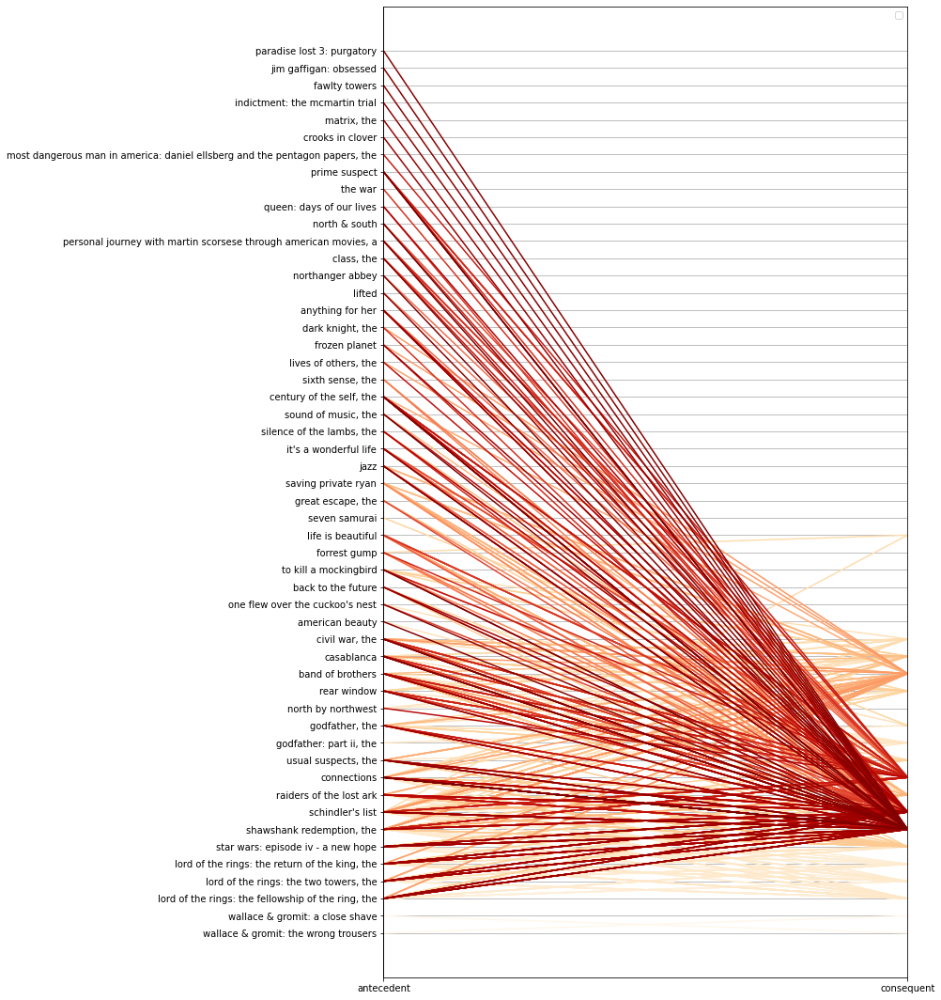


<p style="text-align:justify">Using parallel coordinates plot of the antecedent-consequent pair, we can visually see on how movies are connected to each other. We can see that there is a high concentration to some of the movies which could possibly help the unpopular movies to be watched when placed together.</p>


```python
display(HTML('''<center style="font-size:12px;font-style:default;"><b>
Figure 9. Heatmap based on lift of the antecedent-consequent pair
</b></center>'''))

X = df_lift[:100]

pivot = X.pivot(index = 'consequent',
                columns = 'antecedent', 
                values= 'lift')

# Generate a heatmap with annotations on and the colorbar off
plt.figure(figsize=(20,10))
sns.heatmap(pivot, annot = False, cbar = True)
b, t = plt.ylim() 
b += 0.5 
t -= 0.5
plt.ylim(b, t)
plt.yticks(rotation=0)
plt.xticks(rotation=90)
plt.show()
```


<center style="font-size:12px;font-style:default;"><b>
Figure 9. Heatmap based on lift of the antecedent-consequent pair
</b></center>


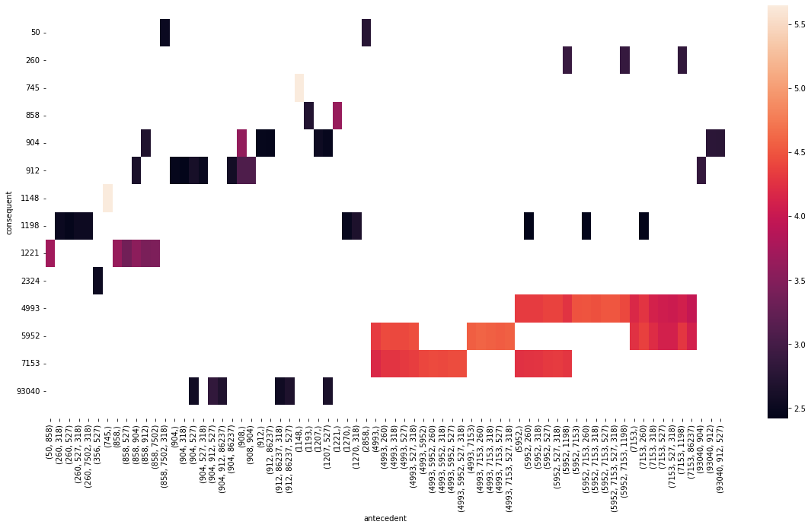


<p style="text-align:justify">Alternative plot to parallel coordinates is heatmap, although we cannot see clearly the connections of the movies, unlike parallel coordinates we got a sense of the value of the lift. Looking at the top 100 lift values, the team observed that not all movies have a value on the heatmap whereas some movies have really high value of lift</p>

<h2><font color='#E50914'> VI. Conclusion </font></h2>

<p style="text-align:justify">The streaming space continues to expand rapidly through time. Within the period of the study, from 1999 to 2005, there has already been an exponential growth in the number of movies for both Netflix and MovieLens. With the number of movies growing between the two platforms, we have observed its user's behavior on the way they rate the movies. The average yearly ratings in MovieLens dropped from 3.75 to an average of about 3.45, while Netflix rose its average ratings from 3.3 to 3.7. It means that users of Netflix are primarily satisfied with what they watch on the platform. Meanwhile, looking at the user's engagement in reviewing the movie by providing ratings, we can also observe similar results where Netflix ratings exponentially increases in quantity while MovieLens fluctuates and declines.
</p>

<p style="text-align:justify">Long term dominance of Netflix seems to be visible in these data. However, when we looked at the top-rated movies with at least ten thousand users who rated them, the top 5 that we got from MovieLens are actually higher than of Netflix, meaning there are excellent movies in the MovieLens database. Some movies were included in the top-rated movies while also having one of the most significant counts of users who rated them. One sample movie is <i>Shawshank Redemption</i>. The type of movies based on the top-rated and most rated movies are also different. MovieLens was more for classic movies, while for Netflix it was the mainstream movies.</p>

<p style="text-align:justify">The team performed a recommender system based on latent factor models. In particular, we have explored Singular Value Decomposition (SVD) and Non-negative Matrix Factorization (NMF). Using SVD we got 4717 unique movies to recommend to Netflix while using NMF, we got 9,471. The team then evaluated our models by using error metrics such as RMSE, MSE, and MAE. Overall, SVD models seem to perform better than NMF. </p>

<p style="text-align:justify">Since the number of recommended movies was huge for Netflix and could be expensive to acquire, the team used the Frequent Itemset Mining technique to trim the number of recommended movies to 58 by applying minimum support of at least 10 percent of the users. Finally, since we are recommending several movies to Netflix, we do not want users to explore the new movies on their own. Instead, we have suggested for Netflix to have some stragtegy in the movie placements/arrangements that the team believed would work based on what the users previously watched.</p>

<p style="text-align:justify">In this technical report, we have observed the difference between the behavior of users in the two platforms throughout the years. We also have given recommendations to Netflix users about movies only found currently on MovieLens, filtered the total number of recommendations into a manageable amount, and suggested movie placement strategies for Netflix.</p>

<h2><font color='#E50914'> VII. Recommendations </font></h2>

<p style="text-align:justify">Our team recommends future proponents or researchers who have interest in this topic to delve further into the subject by improving their datasets for both Movielens and Netflix to the latest available update. This will reflect recommendations for the current video streaming era as opposed to the movie mailing era this research’s results highlighted on. Other movie rating datasets from HBO, Amazon Prime or AppleTV could also be used to further broaden the scope.</p>

<p style="text-align:justify">They could also explore other collaborative filtering recommender system models aside from the latent factor-based models SVM and NMF. Neighborhood based model are suggested so that the difference of user-based and item-based recommendations can be further evaluated. Finally, to further improve the complexity and accuracy, the incorporation of content-based recommender systems with collaborative filtering methods is advised. Contents such as regions, class, genre can be explored that could be an important factor for recommending movies.</p>


<h2><font color='#E50914'> References </font></h2>

[1] McFadden, C. (2020) "The Fascinating History of Netflix". https://interestingengineering.com/the-fascinating-history-of-netflix <br> <br> 
[2] Wang, B. (2021) "Matrix Factorization in Recommender Systems". https://towardsdatascience.com/matrix-factorization-in-recommender-systems-3d3a18009881<br> <br> 
[3] Seeda, P. (2021) "A Complete Guide To Recommender Systems — Tutorial with Sklearn, Surprise, Keras, Recommenders" https://towardsdatascience.com/a-complete-guide-to-recommender-system-tutorial-with-sklearn-surprise-keras-recommender-5e52e8ceace1<br> <br> 
[4] Mavuduru, A. (2020) "How you can build simple recommender systems with Surprise." https://towardsdatascience.com/how-you-can-build-simple-recommender-systems-with-surprise-b0d32a8e4802<br> <br> 
[6] Isinkaye, F.O., etal. (2015) "Recommendation systems: Principles, methods and evaluation" https://www.sciencedirect.com/science/article/pii/S1110866515000341<br><br>
[7] Chen, D. (2020) "Recommender System — singular value decomposition (SVD) & truncated SVD". https://towardsdatascience.com/recommender-system-singular-value-decomposition-svd-truncated-svd-97096338f361 
